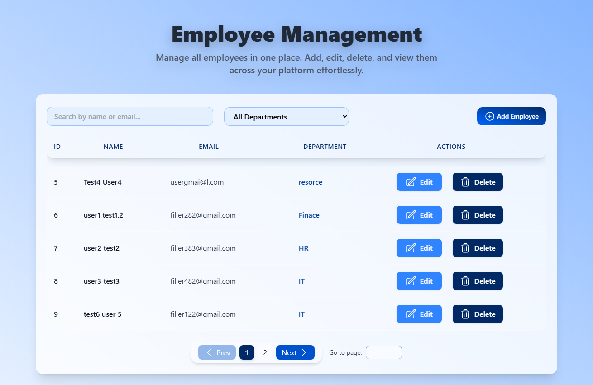
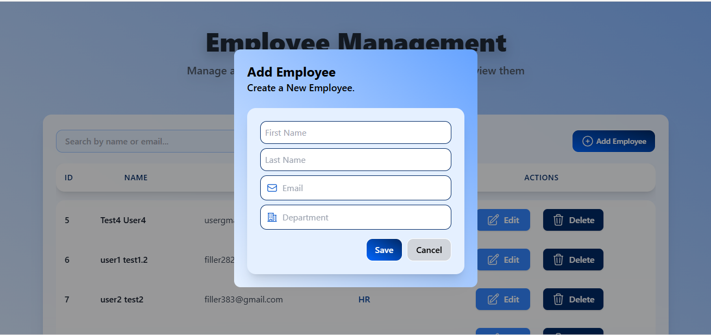
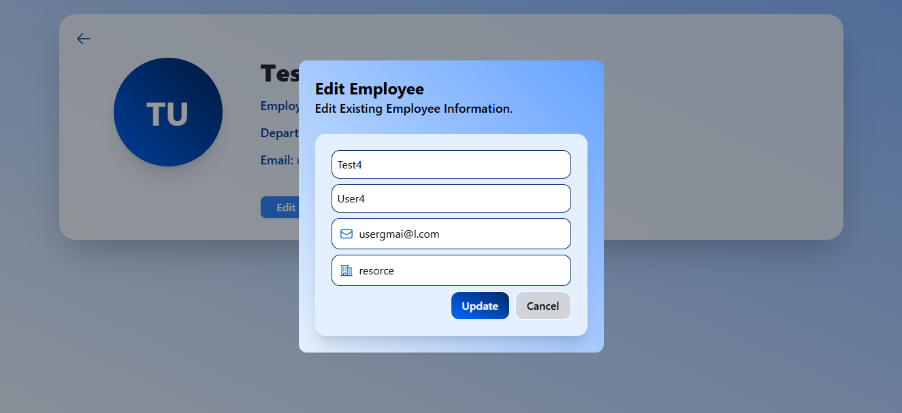
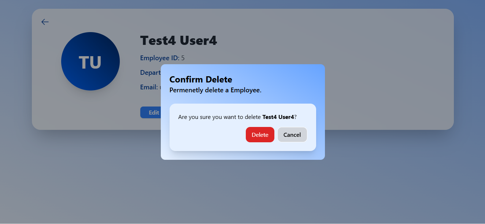

# 📘 Employee Management System (EMS)

A modern full-stack **Employee Management System** built with:

- ⚙️ Spring Boot (Backend API)
- ⚛️ React + Vite (Frontend)
- 🎨 Tailwind CSS (UI Styling)
- 🗄️ MySQL (Database)

The system allows users to:

- ✅ Create employees
- ✅ Edit employee information
- ✅ Delete employees
- ✅ View detailed employee profiles
- ✅ Search by name/email
- ✅ Filter by department
- ✅ Paginate results

---

# 🚀 Technologies Used

## 🔹 Backend
- Java 17+
- Spring Boot
- Spring Data JPA
- Hibernate
- MySQL
- Maven
- RESTful API
- Global Exception Handling
- DTO Layer
- Validation
- Pagination & Filtering

## 🔹 Frontend
- React (Vite)
- React Router
- Axios
- Tailwind CSS v3

## 🔹 Tools & Development Environment
- IntelliJ IDEA
- Postman
- Git & GitHub

---

# 🤖 AI Tools Used

This project leveraged AI tools to improve development speed and quality:

- **GitHub Copilot** → Used for code suggestions and implementation assistance.
- **ChatGPT** → Used for research, architecture decisions, UI design ideas, debugging guidance, and documentation writing.

AI tools were used as development assistants, while all architectural decisions and implementation logic were validated and structured manually.

---

# 📂 Project Structure

```
ems-backend/
├── controller
├── service
├── repository
├── dto
├── exception
└── model

ems-frontend/
├── src/
│ ├── components/
│ ├── pages/
│ ├── api/
│ └── main.jsx
└── index.html
```
# ⚙️ Backend Setup

## 1️⃣ Clone Repository

```bash
git clone https://github.com/Sasidula/employee-management-system
cd ems-backend
```

## 2️⃣ Configure Database

Create a MySQL database:

```bash
CREATE DATABASE ems_db;
```

Update `application.properties` with your MySQL credentials:

```properties
spring.datasource.url=jdbc:mysql://localhost:3306/ems_db
spring.datasource.username=your_username
spring.datasource.password=your_password

spring.jpa.hibernate.ddl-auto=update
spring.jpa.show-sql=true
```
## 3️⃣ Run Backend

```bash
mvn spring-boot:run
```
The backend API will be available at 

```
`http://localhost:8080`
```

# 💻 Frontend Setup

## 1️⃣ Navigate to Frontend

```bash
cd ems-frontend
```
## 2️⃣ Install Dependencies

```bash
npm install
```
## 3️⃣ Run Frontend

```bash
npm run dev
```

The frontend will be available at

```
http://localhost:5173
```
# 🔌 API Features

## Employee Endpoints

| Method | Endpoint            | Description             |
|--------|---------------------|-------------------------|
| GET	   | /api/employees      | Get paginated employees |
| GET    | /api/employees/{id} | Get employee by ID      |
| POST   | /api/employees      | 	Create employee        |
| PUT    | /api/employees/{id} | 	Update employee        |
| DELETE | /api/employees/{id} | 	Delete employee        |

Supports query parameters:
- `?page`=0
- `?size`=5
- `?search`=keyword
- `?department`=IT

# 🎨 UI Features

- Responsive layout
- Glassmorphism cards
- Gradient digital-blue theme
- Modal forms for Create/Edit/Delete
- Profile detail page
- Pagination with page jump
- Hover effects and smooth transitions

# 📸 Screenshots






# 📝 Conclusion

This Employee Management System demonstrates a modern full-stack application with a clean architecture, robust backend API, and a sleek frontend UI. It provides essential CRUD operations along with search, filter, and pagination features to manage employee data effectively. The use of AI tools like GitHub Copilot and ChatGPT enhanced development efficiency while ensuring code quality and maintainability.

# 📄 License

This project is for educational and portfolio purposes.